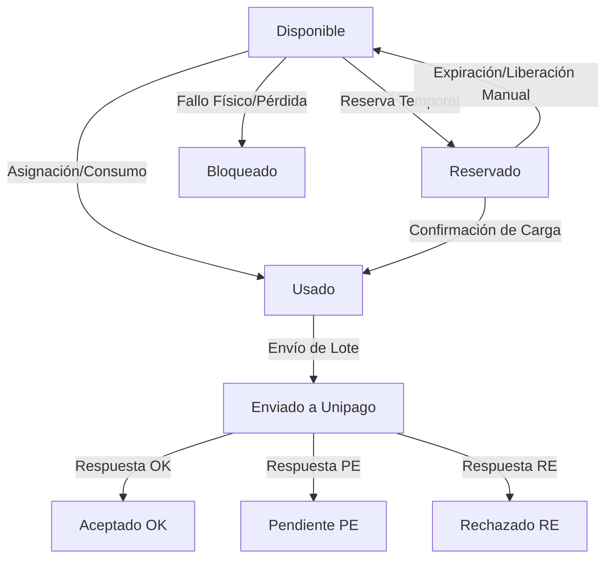

# Control de Formularios y Contratos de Afiliación (Unipago)

Este módulo gestiona y audita los rangos numéricos de formularios/contratos autorizados para el proceso de afiliación de titulares de la ARS ante Unipago. 

---

## 1. Ciclo de Vida de los Números de Contrato

Cada número individual generado dentro de un rango autorizado pasa por los siguientes estados:



---

## 2. Modelos y Base de Datos

El sistema está respaldado por las siguientes 4 tablas relacionales:

1.  `affiliation_contract_ranges`: Contiene los metadatos del rango aprobado (inicio, fin, cantidad disponible, reservada, usada).
2.  `affiliation_contract_numbers`: Almacena el número individual y su estatus transaccional.
3.  `affiliation_contract_movements`: Bitácora histórica detallada de cada transición de estatus.
4.  `affiliation_contract_reservations`: Registro de reservas temporales con tiempo de expiración.

---

## 3. Guía de Uso del Módulo

### A. Crear un Rango y Generar Números
1.  Navegar a **Afiliaciones > Control de Formularios**.
2.  Presionar en **Nuevo Rango**.
3.  Ingresar los límites (ej: desde `450000` hasta `450200`), el origen y la resolución aprobatoria.
4.  El sistema validará que no se solape con otro rango y creará los números disponibles atómicamente.

### B. Asignación en Creación de Titulares
1.  Ir a **Afiliar Nuevo Titular**.
2.  En el campo **Número de Contrato / Formulario**:
    *   Si se deja vacío, el sistema asignará de forma transaccional el próximo disponible.
    *   Si se ingresa un número manual, el sistema verificará que pertenezca a un rango activo, que esté disponible y que no esté duplicado o bloqueado.
3.  Al guardar, el contrato pasa a estado `usado` asignado al afiliado.

### C. Procesamiento en Unipago
1.  Al simular y procesar un lote en Unipago, los contratos asociados pasan automáticamente al estado correspondiente (`ok`, `pe`, `re`).
2.  Si un contrato es rechazado (`re`), quedará marcado con la descripción del motivo de rechazo brindado por Unipago.

---

## 4. Comandos de Consola y Tareas Programadas

Para liberar reservas temporales que han expirado sin que la transacción haya culminado:
```bash
php artisan contracts:release-expired-reservations
```
Se recomienda programar esta tarea cada 15 minutos en el programador de tareas (`Kernel.php`).
