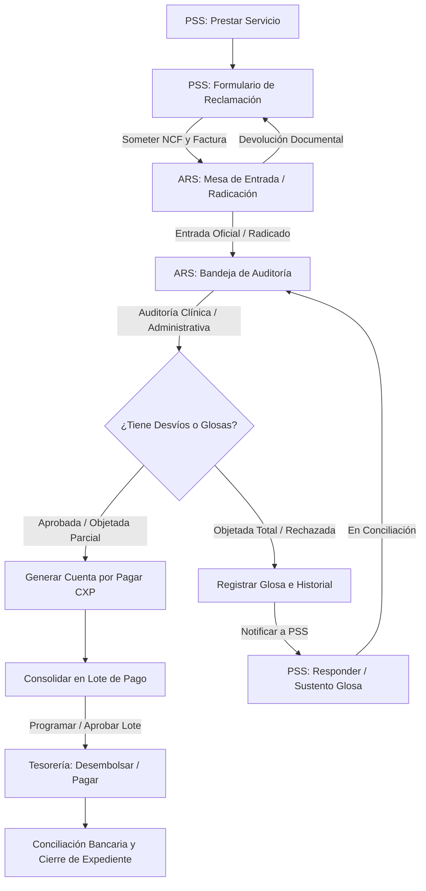

# Documentación: Ciclo de Reclamaciones Médicas PSS (ARS CMD)

Este documento describe la arquitectura técnica, flujo de datos y reglas de negocio del proceso de facturación, auditoría, glosas, cuentas por pagar y desembolso del Core ARS CMD y el Portal PSS.

---

## 1. Flujo Operativo y de Datos

---

## 2. Descripción de Módulos Implementados

### 2.1 Mesa de Entrada (Radicación)
Las reclamaciones enviadas digitalmente por las prestadoras (PSS) a través de su portal son dirigidas a la Mesa de Entrada oficial de la ARS. El departamento administrativo verifica los documentos soporte mínimos y procede con:
- **Radicación:** Se le otorga un número correlativo oficial de entrada (`ENT-YYYY-XXXXXX`) y cambia a `En auditoría de reclamación`. A partir de este momento se computan los días en proceso.
- **Devolución:** Si falta documentación mínima (e.g. firma de afiliado, factura ilegible), el expediente es devuelto a la PSS con una observación detallada, deteniendo el plazo de procesamiento.

### 2.2 Bandejas de Auditoría (Médica y Administrativa)
Los auditores evalúan pertinencia clínica y consistencia tarifaria:
- **Auditoría Médica:** Analiza la pertinencia clínica del diagnóstico versus el procedimiento. En caso de desviación o servicios extemporáneos, genera glosa médica.
- **Auditoría Administrativa/Facturación:** Concilia tarifas contra contrato vigente. Las diferencias se objetan parcialmente.

### 2.3 Conciliación de Glosas
Cuando existe una objeción parcial o total, se genera una Glosa (`ClaimGlosa`) en estado `Notificada a PSS`. La PSS puede:
- Ver el detalle de la objeción en su portal.
- Subir su justificación o descargo (POST a `/reclamaciones/{id}/glosa/{glosaId}/responder`).
- Cambiar la glosa a `En conciliación` para que el auditor médico de la ARS levante o ratifique la glosa definitiva.

### 2.4 Generación de Cuentas por Pagar (CXP)
Al autorizar el pago (neto aprobado), el sistema:
1. Crea un registro en `accounts_payable`.
2. Calcula retenciones fiscales automáticas (e.g. 10% de ISR para PSS físicas).
3. Genera un asiento contable por devengo de reclamación liquidada (`AccountingPostingService::registrarCuentaPorPagar`).

### 2.5 Lotes de Pago y Conciliación Bancaria
Las CXP en estado `Contabilizada` pueden ser agrupadas en lotes de pago (`PaymentBatch`):
1. **Borrador:** Agrupación inicial de facturas seleccionadas.
2. **Programado:** Aprobación de tesorería y programación de fecha.
3. **Pagado:** Ejecución física del pago. Genera asiento bancario (`AccountingPostingService::registrarPagoLote`).
4. **Conciliado (Cierre):** Se sube el número de referencia bancaria y se cierra formalmente el ciclo del expediente, actualizando los estados a `Cerrada` y `Conciliada`.

---

## 3. Control de Plazos y Semáforos (Aging)

El motor `ClaimAgingService.php` computa la antigüedad del expediente en días a partir de la entrada oficial (`received_at`). Se clasifica de manera semafórica en la interfaz del core:
*   **Verde (`1 a 30 días`):** Expediente a tiempo dentro del plazo operativo estándar.
*   **Amarillo (`31 a 60 días`):** Expediente con prioridad media en auditoría.
*   **Naranja (`61 a 90 días`):** Expediente prioritario de liquidación.
*   **Rojo (`Más de 90 días`):** Expediente vencido. Requiere alerta inmediata.

---

## 4. Cobertura de Pruebas Automatizadas

El test de integración `tests/Feature/ClaimLifecycleTest.php` cubre el ciclo de vida completo:
- Sometimiento de reclamación con NCF y factura.
- Radicación en Mesa de Entrada ARS.
- Aplicación de Auditoría con objeción parcial y generación de Glosa.
- Envío de descargo de glosa por la PSS.
- Generación y contabilización de la Cuenta por Pagar (CXP).
- Creación, aprobación, desembolso y conciliación bancaria del Lote de Pago.
